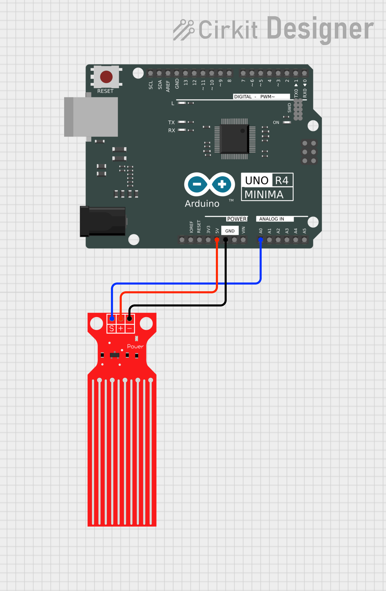

# PyArduinoReader
A small project meant to make an Arduino UNO R4 Minima communicate with Python via pyserial and to store read data inside a MySQL database.
## Circuit

The board used for this project is an Arduino UNO R4 Minima, which is the successor to the widely popular UNO R3, and the circuit is as basic as it gets: 

-   one arduino board
-   one water sensor

The board gets the data from the sensor via the analog pin A0, and gives power via the 5V pin and the GND pin to close the circuit.

The retrieved data get then handled in our Python app.